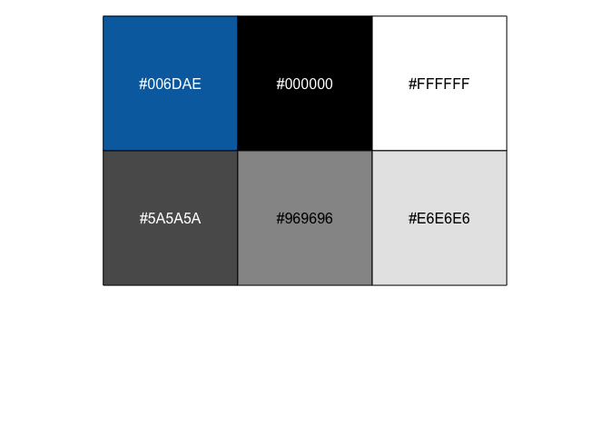
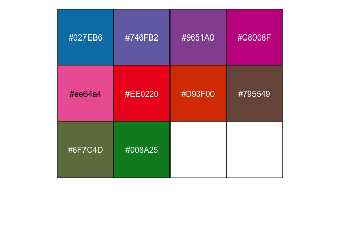

<!-- README.md is generated from README.Rmd. Please edit that file -->

# monash

<!-- badges: start -->

[](https://www.tidyverse.org/lifecycle/#experimental)
<!-- badges: end -->

The `monash` R-package is a utility package with consolidated tools and
templates for staffs at Monash University. The package contains three
primary themes:

  - **workflow**: automating repetitive tasks, particularly teaching
    related activities;
  - **template**: Monash branded R Markdown templates for teaching,
    presentation, etc; and
  - **data**: easy access to relevant information (may require access
    privileges).

## Installation

You can install `monash` R-package as below:

``` r
# install.packages("remotes")
remotes::install_github("numbats/monash")
```

## Get Monash logo

``` r
# default logo
monash::logo_insert(path = "man/figures")
#> ✔ The 'monash-stacked-blue-rgb.png' is now in 'man/figures/'
```


``` r
# black and white & one-line version of the logo
monash::logo_insert(path = "man/figures", color = "black", stack = FALSE)
#> ✔ The 'monash-one-line-black-rgb.png' is now in 'man/figures/'
```


## Get Monash brand colors

These are handy commands to quickly see Monash brand colors and be able
to copy-and-paste the hex color codes.

``` r
monash::color_primary_show()
```



    #>      blue     black     white    gray80    gray50    gray10 
    #> "#006DAE" "#000000" "#FFFFFF" "#5A5A5A" "#969696" "#E6E6E6"
    monash::color_secondary_show()



    #>      blue    purple   fuchsia      ruby      pink       red    orange     umber 
    #> "#027EB6" "#746FB2" "#9651A0" "#C8008F" "#ee64a4" "#EE0220" "#D93F00" "#795549" 
    #>     olive     green 
    #> "#6F7C4D" "#008A25"

## Settings

(WIP) The monash package makes use of some values, listed below, from
your R profile. You can modify this by using `usethis::edit_r_profile()`
and adding below with values modified to your own values.

    options(monash.full_name = "Emi Tanaka",
            monash.email = "emi.tanaka@monash.edu",
            monash.orgunit = "Department of Econometrics and Business Statistics",
            monash.teaching_dir = "~/teaching/monash/",
            monash.workshop_dir = "~/workshop/")

## Teaching

(WIP) `create_teaching_directory("ETCXXXX")` would create a skeleton
directory with folder and file structure below for development of
teaching material. What is the advantage of this structure? It’s
designed to be synced with a private github repository and the materials
in the `release` folder are *automatically* pushed using Github
Repository to the public github repository for public release. The
website associated with it will be also be built automatically as well.
The website format will closely resemble [ETC5512: Wild-Caught
Data](https://wcd.numbat.space/).

(WIP) `release_tutorial(1)` moves `tutorial-01.html` (and .Rmd) to the
appropriate place in the `release` folder.

(WIP) Tutorial, slides and other templates for teaching.

    ├── ETCXXXX.Rproj
    ├── .git
    ├── data
    │   └── data01.csv
    ├── lectures
    │   ├── assets
    │   │   ├── monash-brand.css
    │   │   └── monash-font.css  
    │   ├── images
    │   │   ├── lecture-01-image01.png
    │   │   └── lecture-02-image01.png  
    │   ├── lecture-01.Rmd
    │   ├── lecture-02.Rmd
    │   └── lecture-03.Rmd
    ├── tutorials
    │   ├── images
    │   │   ├── tutorial-01-image01.png
    │   │   └── tutorial-02-image01.png 
    │   ├── tutorial-01.Rmd
    ├── assessments
    │   ├── assignment-01.Rmd
    │   └── quiz-01.Rmd
    ├── release # for public release
    │   ├── site
    │   │   └── _site.yml
    │   ├── data
    │   ├── lectures
    │   ├── tutorials
