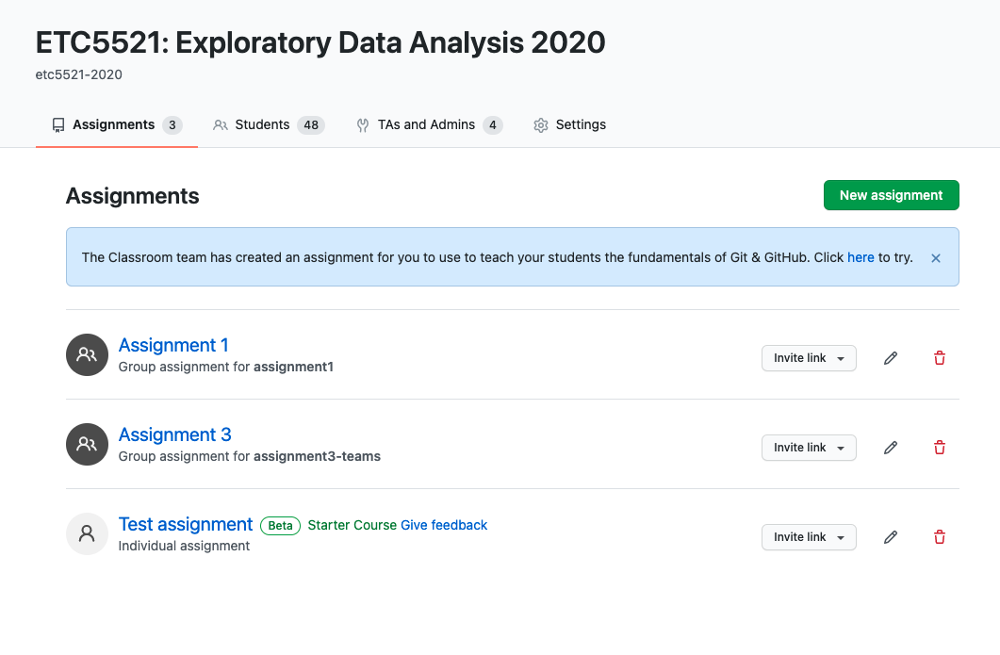

To get started with GitHub Classroom, you should first create a GitHub organisation. You need to create a new organisation for each class so I recommend appending your organisation with the year or semester, e.g. `etc5521-2021` or `etc5521-2021-S2`. 

Once you create the GitHub organisation: 

1. invite your teaching team as owners
2. add the description of your repo to be meaningful. I recommend the course code followed by the course name and the year, e.g. "ETC5523: Communicating with Data 2021". 
3. optionally add the Monash logo as a profile photo

Next to create the GitHub classroom, go to https://classroom.github.com/ and select new classroom. You should select the GitHub organisation you created in the previous step. 

## An example

You can find an example organisation repo for ETC5521 2020 here: https://github.com/etc5521-2020. You'll find the student's (public) repos created from assignments in the GitHub classroom. You can set the repos to be private in the assignment if you don't want students to be able to see other students work. I would encourage you to keep it public if each student/team have different questions as students can use the public repo to showcase their work in their CVs. 

A GitHub classroom may look like below. Only those with admin priveleges can see this. You can see that students who accepted to invite are in the student tab. The students should be encouraged to link their their account with their GitHub account. 

Make sure to invite your teaching team as admins to the GitHub classroom. The teaching team needs to be owner in the corresponding GitHub organisation.
