```{r, include = FALSE}
knitr::opts_chunk$set(
   collapse = TRUE,
   comment = "#>"
)
options(rmarkdown.html_vignette.check_title = FALSE) 
```

Panopto videos, referred to as sessions, are composed of one or more streams, which may include video, powerpoint slides, screen capture, etc. You can add interactions to the session, such as quizzes and web links. This guide is mainly divided into three sections, **Add Panopto block**, **Working with Sessions** and **Working with Folders** and covers some general actions as shown below:

# Add Panopto Block

To use Panopto, you'll first need to add the Panopto block to your Moodle unit and provision your unit. This only needs to be done once per unit.

## Add the Panopto block

1. Navigate to the Moodle unit that you would like to use Panopto.
2. Ensure that editing is turned on.
3. Open the **Navigation Drawer** and scroll down and click the **Add a Block** button.

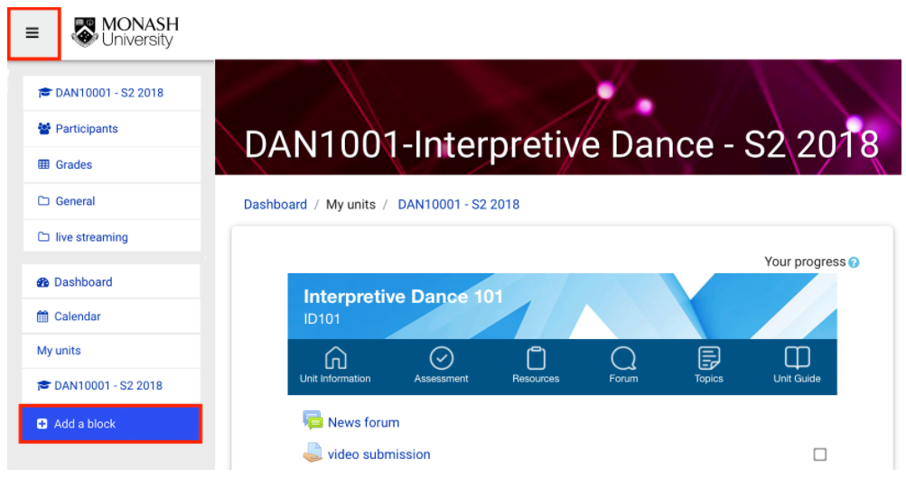{width=85%}

4. Select **Panopto** from the list to add the block. If you do not see Panopto on the list, the Panopto block may have already been added to your unit.

5. If your unit has already been provisioned by your Moodle administrator you will see an image similar to the one below. If not yet provisioned, follow the instructions below.

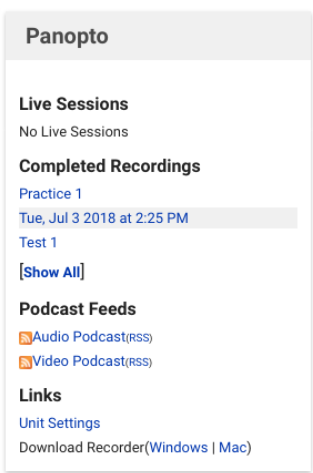

## Provision your unit

1. Click Provision unit.
2. Provisioning a unit creates a link between Moodle and Panopto and assigns the following roles:

  - **CREATORS**- lecturer, non-primary-lecturer, tutor, designer
  
  - **VIEWERS** - students, observers, guests
  
3. Once provisioned, you will receive a success message to confirm that the unit has been provisioned, a Panopto folder has been created, and users have been given access.

4. You can now return to the unit and use the Panopto block features.

# Working with Sessions

## Search for a video (session)

1. Navigate to the Panopto portal.
2. In the top **Search bar**, type in the name of the session you’re searching for.
3. Press **Enter** on your keyboard or click on the magnifying glass.


## View a video (session)

1. Navigate to the Panopto portal.
2. Locate the session that you want to view.
3. Click on the session. A new window tab will be opened and will automatically play the session.


## Change Video (session) Name

1. Hover over the session and click on the **Settings** icon.
2. Navigate to the Panopto portal.
3. Locate the folder that has the session that you want to rename.
4. A dialog box will pop up. In the **Overview** tab, in the **Name** field, click **Edit**.

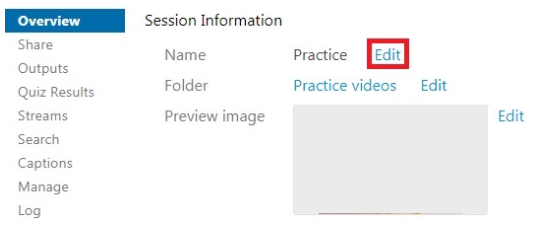

5. Enter a new name and click **Save**. If you want to discard the changes, click **Cancel**.

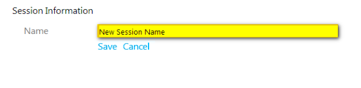


## Choose when videos (sessions) become and remain available

1. Navigate to the Panopto portal.
2. Locate the session that you want to edit the availability preferences of.
3. Hover over the session and click on the **Settings** icon.
4. Scroll down in the **Overview** tab.

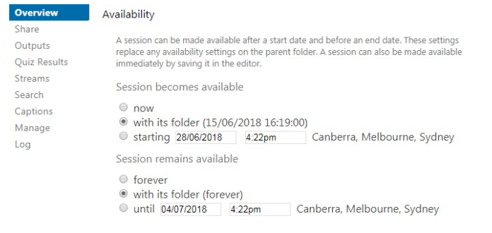

5. Under the **Availability** section, you will see the different options for availability listed.
    - **With its folder** - Sessions will be available as you have chosen in the availability setting for its parent folder.
    
    - **Starting on (specified time and date)** - Sessions will become available after a scheduled time.
    
6. You can also choose when the sessions within the folder will **remain** available.
    - **Forever** - Sessions will be available online indefinitely.
    
    - **With its folder** - Sessions will remain available as you have chosen in the availability setting for its parent folder.
    
    - **Until (specified time and date)** - Sessions will become unavailable after a scheduled time.

7. Once you have chosen your availability settings, your preferences will be saved automatically and you can close the dialogue box.

## Change user access to download at session level

1. Navigate to the Panopto portal.
2. Locate the session you want to change download settings.
3. Hover over the session and click on the **Settings** icon.
4. A dialog box will pop up. Within the **Overview** tab, navigate to the **Downloads** field
5. There are three options to select who will have the ability to download sessions:

  - **Use Site Default** - This setting means that it will use the default site-wide setting set by the site administrators. The site default will appear in parentheses as shown above.
  
  - **No One** - No users will see the download button in the session viewer.
  
  - **Authenticated users with access** - Only users who have access and are authenticated into Panopto will see the download button in the session viewer.
  
**Note:** Once you make your selection, the Panopto site will automatically save your changes.


## Download a Panopto video (session)

1. Navigate to the Panopto portal.
2. Locate the session that you want to download.
3. Click on the session. A new window tab will be opened and will automatically play the session.
4. On the top right hand corner, click the Download podcast icon .

**Note:** You can change the access to allow/not allow users to download a session.

## Delete a Panopto video (session)

1. Navigate to the Panopto portal.
2. Locate the folder that has the session that you want to delete and hover over the session.
3. If you delete the session, it will no longer be available online, and you will not be able to recover it. When ready, click on the **Delete** icon.
4. A dialog box will pop up, asking for confirmation. Click **OK**. The page will refresh once deletion is completed.

## Delete,Copy,Move or Share multiple videos (sessions)

You can move or copy multiple recordings within the same folder to a different folder.

1. Navigate to the Panopto portal.
2. Locate the folder that has the multiple session you would like to move or copy.
3. Selecting  check boxes to next to multiple sessions will make extra actions appear.

**Note:** Selecting the checkbox at the very top will select all sessions in the folder.

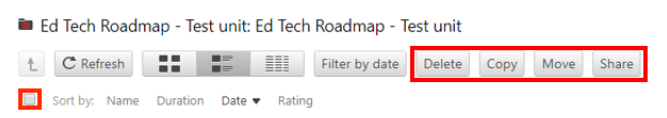


Once the files are selected, you can choose to:

- **Delete multiple sessions:**

   - Click on the **Delete** button.
  
   - A dialog box will pop up, asking for confirmation. Click **OK**. The page will refresh once the session are deleted.
  
**Note:** If you Delete the session, it will no longer be available online, and you will not be able to recover it.

- **Copy multiple sessions:**

   - Click the **Copy** button. A window will pop up with a list of the sessions that have been selected.
  
   - Click **Choose a folder or start typing to search** and, locate the folder you would like to create copies of the selected sessions in. This menu will contain all Folders that you have access to.
  
  - Click the green **Copy** button.
  
  - When all the selected sessions have been copied, the button will be replaced from Copy to **Done**. It is safe to close the window.

- **Move multiple sessions**

  - Click **Move** button. A window will pop up with a list of the sessions that have been selected.
  
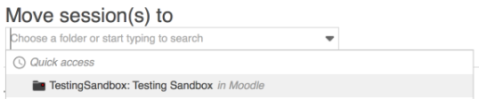

  - Click **Choose a folder or start typing to search** and locate the folder you want to move the sessions into. This menu will contain all Folders that you have access to.
  
  - Once the folder is selected, a green **Move** button will appear to the right of it. Click the button and the sessions will be moved.
  
  - When the move is completed, the button will be replaced from Move to **Done**. It is safe to close the window.
  
- **Share multiple sessions**

  - Click the **Share** button. A window will pop up with a list of the sessions that have been selected.
  
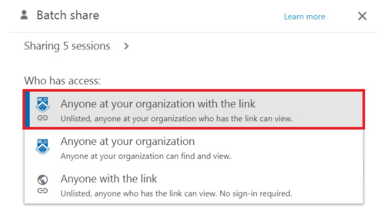

  - Click the **Who has access** box. It will reveal the different ways to share the selected sessions:
  
      - **Specific people** - Only specific users and groups can view. Use the **Invite people** to search for specific people you would like to share your sessions with.
      
      - **Anyone at your organization with the link** - Unlisted, anyone at your organization who has the link can view.
      
      - **Anyone at your organization** - can find and view
      - **Anyone with the link Unlisted** , anyone who has the link can view. No sign-in required

  - You can close the window after you have finished sharing the sessions.
  

## Share a Panopto video (session)

You can choose to change the sharing settings for an individual video or all videos within your unit folder, you can do this at the Folder settings level, as all sessions within the folder will inherit folder settings. You can share individual videos from your My Folder, however you cannot change your **My Folder** sharing settings. If you would like to share all videos in your **My Folder**, it is recommended that you move or copy videos to a different folder. For more information, see **Working with folders** section.


- **Sharing settings individual sessions**

  1. Navigate to the Panopto portal.
  2. Locate the session that you want to share.
  3. Hover over the session and click **Share**. A dialogue box will pop up.

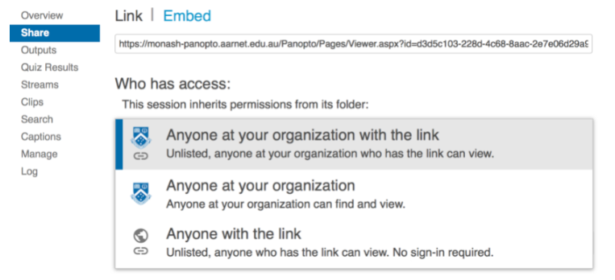  

  4. There are a number of ways to share a session:
        
        - Copy the link.
        - Click **Embed**, and copy the HTML code to embed your session.
        - Select **Who has access** from the drop down list.
        
           - **Anyone at your organization with the link** - Unlisted, anyone at your organization who has the link can view
              
           - **Anyone at your organization** - can find and view
           
           - **Anyone with the link** - Unlisted, anyone who has the link can view. No sign-in required.
              
           - **Invite people** by typing the email address of the person you would like to share with. The field is already pre-filled with the Monash University’s staff directory.
        
  5. Click **Save changes** button.
  
  
  
# Working with Folders

##  Create Folder

1. Navigate to the Panopto portal.
2. Click the green Create button at the top of the screen, choose the option to create a **New Folder**.
3. A dialog box appears. Type in a folder name and enter a description (optional).
4. If you’re creating a child folder (sub folder) select the **Parent folder** in the drop down list
5. Click **Create Folder**.
  
  
## Delete Folder

1. Navigate to the Panopto portal.
2. Locate the folder that you want to share.
3. Hover over the folder and right-click on your mouse.
4. Click the **Settings** icon.
5. A dialog box will pop up.
6. Click the **Manage** tab.
If you Delete the folder, it will no longer be available online, and you will not be able to recover it. When ready, click on the **Delete** link

## Move Sessions between Folders

1. Navigate to the Panopto portal.
2. Locate the session that you want to move and select it.
3. Click on the **Settings** icon.
4. Within the **Overview** tab, navigate to the **Folder** field and click **Edit**.
5. Click the drop box to display all folders then click the desired folder. Click **Save**. If you want to discard the changes, click **Cancel**.
6. After saving the changes, the session will automatically be moved to the specified folder.

## Choose when folders become and remain available


1. Navigate to the Panopto portal.
2. Navigate to the folder that you want to set up availability. This will affect the availability of all sessions stored within the folder.
3. Click on the **Settings** icon settings icon in the top right hand corner. A dialog box will pop up.
Click the **Settings** tab.

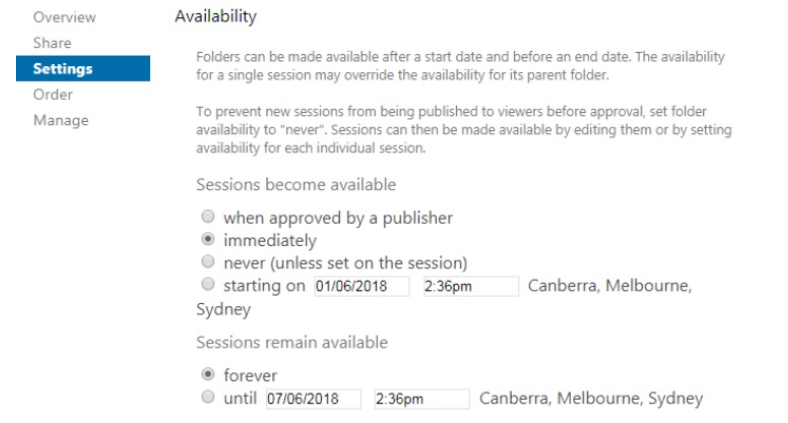{width=85%}

5. Under the **Availability** section, you will see the different options for availability listed.

  - **When approved by a publisher** -  this option is not recommended as students will not be able to view sessions unless approved by nominated publisher.
  
   - **Immediately** - Sessions will be available as soon as they are uploaded online.
   
  - **Never (unless set on the session)** - Sessions will not be available unless made available in the individual session settings.
    
  - **Starting on (specified time and date)** - Sessions will become available after a scheduled time.
    
    
6. You can also choose if sessions within the folder **remain** available.

  - **Forever** - Sessions will be available online indefinitely.

  - **Until (specified time and date)** - Sessions will become unavailable after a scheduled time.
  
  
**Note:** By default, students will lose access to the session (within a Moodle unit's folder) after the student has completed the unit and lose access to the Moodle unit.


## Change user access to download at folder level

1. Navigate to the Panopto portal.
2. Locate the folder you want to change download settings.
3. Click on the **Settings** icon settings icon.
4. Select the **Enable podcast feed** checkbox.
5. In the **Downloads** section, there are three options to select who will have the ability to download sessions.
    - **Use Site Default** - This setting means that it will use the default site-wide setting set by the site administrators. The site default is set to Authenticated users with access.
    
    - **No One** - No users will see the download button in the session viewer.
    
    - **Authenticated users with access** - Only users who have access and are authenticated into Panopto will see the download button in the session viewer.

For educators who have a RSS feed or use podcasts for their teaching, the recommended option is either A or C.

**Note:** Once you make your selection, the Panopto site will automatically save your changes.


## Share Folder

You can choose to change the sharing settings for an individual video or all videos within your unit folder, you can do this at the Folder settings level, as all sessions within the folder will inherit folder settings. You can share individual videos from your **My Folder**, however you cannot change your **My Folder** sharing settings. If you would like to share all videos in your **My Folder**, it is recommended that you move or copy videos to a different folder. For more information about individual videos, see Working with sessions.

### Sharing settings for folders

1. Navigate to the Panopto portal.
2. Locate the folder that you want to share.
3. Hover over the folder and right-click on your mouse.
4. Click the **Share** icon.

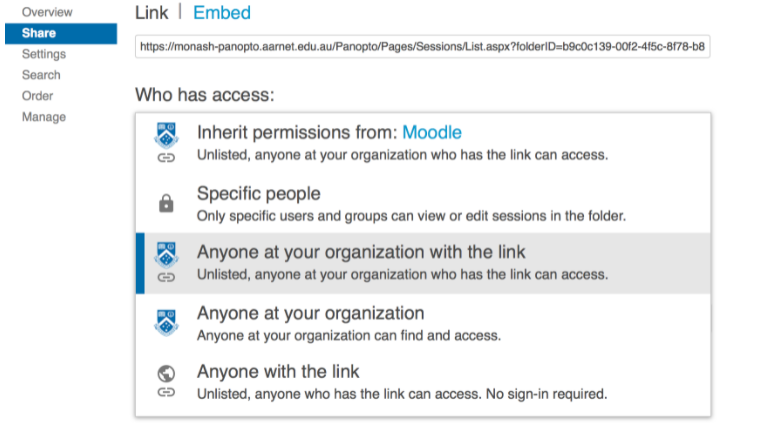
5. There are a few ways to share a folder.

  - Copy the link.
    
  - Click **Embed**, to use the embed codes.
    
  - Click the **Who has access** box. It will reveal the different ways to share the selected sessions:
    
    - **Specific people** - Only specific users and groups can view
      
    - **Anyone at your organisation with the link** - The folder won't be discovered by anyone browsing the site. It can only be accessed by having the direct link.
      
    - **Anyone at your organisation** - This will enable viewing access for anyone who can log into Monash Panopto.
      
    - **Anyone with the link** - The folder won't be discovered by anyone browsing the site. It can only be accessed by having the direct link. However, anyone on the Internet is able to view sessions within the folder. No sign-in is required.
      
    - **Public on the web** - This will allow anyone on the Internet can find and view. No sign-in required.
    - In the **Invite people** field, type the email address of the person you would like to share with. The field is already pre-filled with the Monash University’s staff directory.
      
6. Click the **Save changes** button.

## Working with assignment folders


### Creating an assignment folder


An Assignment Folder is a subfolder that shares its user list with its parent folder, but gives the users some additional privileges. Assignment folders enable Viewer users (students) in their parent folder to create and manage their own content, while preventing them from viewing other users' content that has not been explicitly shared or made public. Viewing video guide full screen in the Panopto player is recommended.

1. Navigate to the Panopto portal.
2. Locate the **Unit Folder** you would like to create the Assignment folder for.
3. Click on the **Settings** icon on the top right of the page.

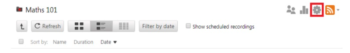

4. A pop up box will appear. Select the **Overview** tab.
5. Click **Create Assignment Folder**.

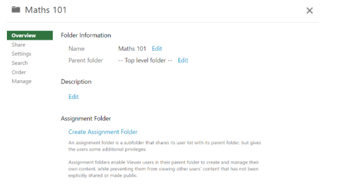
6. Once the assignment folder is created, you will see a new link that has **[assignments]** appended to the end.

**Note:** On the main page, you will see that a folder has been added as a subfolder to the original with the word **"[assignments]"** added to the end. Now, viewers that are shared to the original "Maths 101" will be able to add content to the newly created **[assignments]** folder.


### Allow all users in an assignment folder to view other users' content

If you want students to use Panopto for sharing content instead of for assignment submission, you can allow students to see each other’s videos.

**Note:** Changing this setting will affect all videos in the folder.

1. Navigate to the Panopto portal.
2. Locate the folder you would like to change the settings for.
3. Click the **Setting** icon. Check the **‘Allow viewers to see the other’s sessions’** box.
4. Students will now be able to to view each others videos within this folder. Please note that making this change means you can no longer use this folder for private assignment submissions.

5. Check allow viewers to see each other's sessions

### Share the live-stream from your Panopto folder

The live-stream folder consists of all the recorded live stream sessions.


1. Navigate to the Panopto portal.

2. Locate your Moodle unit’s folder in the Browse section.

3. Click on the Share icon.

4. There are two ways to share your folder by **linking** or **embedding** the folder.

5. Linking the folder:
    - Click on the link to share. Copy the URL link
    - Navigate to your Moodle unit and click **Turn Editing On**
    - Navigate to the resource/activity you would like to link the folder from
    - Copy and paste the URL. Click **Save**.

6. Embed the folder:

  - Click on the Embed link to share. Copy the code.
  - Navigate to your Moodle unit and click **Turn Editing On**
  - Navigate to the resource/activity you would like to embed the folder and click Edit.
  - Click on the HTML icon.
  - Paste the code. Click **Save**.

**Note:** It is recommended to embed videos for a more consolidated learning experience for the students.

You are now ready to teach in a live-stream environment.
